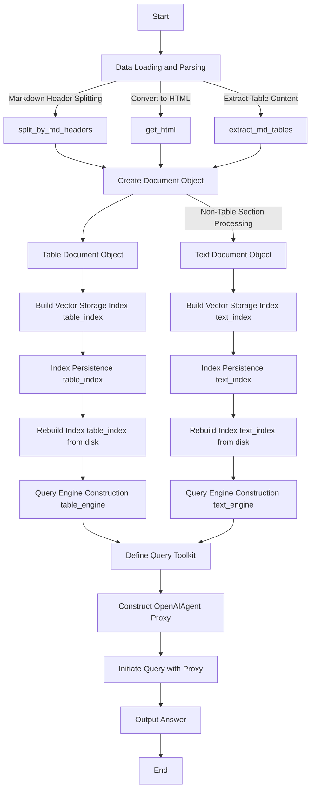
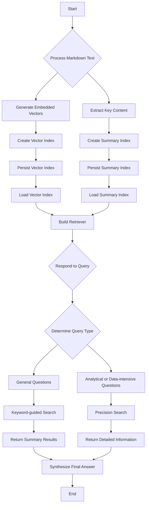
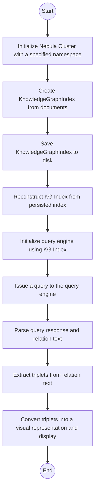

# Running Rag Retrievers on Docker Containers

## Technical Background

This demo utilizes technologies such as llama-index, OpenAI's models, and Knowledge Graph Indexing (KGI) to implement Retrieval-Augmented Generation (RAG), enhancing the efficiency and accuracy of private domain material retrieval queries.

- **Enhanced Data Retrieval**: The demo successfully addresses queries associated with structured tabular data and unstructured plain text by isolating each type of content.
- **Intuitive Query Intent Recognition**: By discerning the user's search intent, the system differentiates between broad overviews and specific details to fulfill informational needs accurately.
- **Knowledge Graph Indexing (KGI)**: Utilizing a tree-like structure summary within the Graph Rag component, our demo produces well-organized hierarchical responses that efficiently tackle data-intensive inquiries.

### Textual Features (Table+Text: Table-Tool & Text-Tool)

1. **Markdown File Preprocessing**: Split md files into sections using headings and subheadings to structure the document. Isolate table data separately and create vector-based query indices for both text and table data. Persist indices on disk under `db_stores/table_index` and `db_stores/text_index` for rebuilding without reprocessing the raw data.
2. **Retrieval**: Rebuild previously saved indices from disk, turning table and text indices into corresponding `table_tool` and `text_tool` query engines. The proxy decides which tool to use based on the characteristics of the query. Conventional questions prefer `text_tool`; numerical and tabular queries lean towards `table_tool`; complex reasoning requires a combination of both tools.
3. **Answer Synthesis**: The proxy, as required, merges information retrieved by both table and text tools to form a comprehensive answer. This may include analyzing and interpreting structured data as well as understanding and elaborating on textual content.

We have not only improved the accuracy of table data retrieval for documents written in Markdown but also enhanced the capability of information extraction from the entire document, providing robust support for users when dealing with mixed documents containing both text paragraphs and tables.



### Query Intent (Document Agent: Summary_Tool & Vector_Tool)

1. **Markdown File Preprocessing**: Split the md file, organizing the document structure through headings and subheadings. For each extracted section, generate an embedding vector `VectorStoreIndex`, and simultaneously create a summary-style secondary index `SummaryIndex`. Persist the indices to disk under `db_stores/doc_agent_vector_index` and `db_stores/doc_agent_summary_index`, so that they can be reconstructed for queries without having to reprocess the raw data.
2. **Retrieval**: First, use the `rebuild_index` function to rebuild the detailed and summary indices from persistent storage. Then, create a document agent for each keyword, setting up two types of query tools to handle retrieval tasks for details or summaries. Finally, with an index node composed of guidance instructions, a top-level composite retriever and accompanying query engine are created to implement a flexible and efficient query processing architecture.
3. **Answer Synthesis**: Upon receiving a query request, the agent selects the appropriate tool based on the nature of the question: if the question seeks summary information, it would prefer to use the `summary_tool`; if the question requires detailed data, it would opt for the `vector_tool`. Subsequently, the agent synthesizes a comprehensive and contextually appropriate answer using the retrieved detailed vector data and summary information to satisfy the user's need.

A hierarchy of document agents has been built based on embedding vectors and summaries, utilizing these agents to fetch relevant details and synthesizing them into coherent answers for posed questions. This system can provide flexible responses tailored to the user’s familiarity with the knowledge base and the specific nature of the query, ranging from macroscopic topic summaries to microscopic, data-intensive answers.



### Graph Rag (KGI-Based)

1. Preprocessing of Markdown Files: Files are loaded and indexed for easy retrieval later on. The data is indexed using `KnowledgeGraphIndex.from_documents()`, with a maximum set for the number of triplets per block. Indices are persisted to disk at `db_stores/kg_index` for reconstruction during queries without the need to process the raw data again.
2. Retrieval: Initialize a query engine configured to include relevant texts, use a hybrid retrieval mode, and provide tree-like summary responses.
3. Answer Synthesis: Parse out textual answers and knowledge graph relation texts; extract triplets from the relation texts in the form of (entity, relationship, entity). The query engine summarizes information in a tree-like structure, ultimately generating structured and hierarchical answers that satisfy user queries.



## Prerequisites

Before diving into this demo, please ensure that your system meets the following prerequisites:

1. **Operating System**: The demo is compatible with Linux operating systems and tested on Ubuntu 22.04.
2. **Docker**: It's required to have `docker` installed on your system.
3. **OpenAI API Key for ChatGPT**: If you wish to use the ChatGPT functionality within this demo, an OpenAI API key is required. Please note that usage of this API is subject to OpenAI's pricing and usage policies. We use OpenAI text generation models to optimize the parsing of some special components like titles or tables etc. Without this API key, you can still try all three approaches.

## Quick Start

1. Start by cloning this repository to your instance with Docker installed:

   ```shell
   git clone https://github.com/LinkTime-Corp/llm-in-containers.git
   cd llm-in-containers/rag-retrievers
   ```

2. Replace `<YOUR-OPENAI-API-KEY>` with your own API key in the .env file under the `/src/streamlit-web` directory.

3. Launch the demo:

   ```shell
   bash run.sh
   ```

    Visit the UI at http://{IP of Host instance}:8501. On the UI, you can choose any of the three query engines - "Table+Text", "Document Agent", or "Graph Rag (KGI-Based)" to explore the actual query results for the material "The Legend of Zelda: Tears of the Kingdom" (Fan-made).

4. Shut down the demo:

   ```shell
   bash shutdown.sh
   ```

## Using Your Own Markdown Files

1. Start by cloning this repository to your instance with Docker installed:

   ```shell
   git clone https://github.com/LinkTime-Corp/llm-in-containers.git
   cd llm-in-containers/rag-retrievers
   ```

2. Install dependencies in your local environment:

    ```shell
    pip install -r requirements.txt
    ```

3. Replace with your documents:
    Add your markdown format file under `/rag-retrievers/data`.
    Replace all occurrences of `/RAG-Zelda-Tears-of-the-Kingdom(Fan-made).md` with the new filename throughout in project.

4. Create a .env file in the `rag-retrievers` directory:

   ```shell
   echo "data_path=../data\nOPENAI_API_KEY=<YOUR-OPENAI-API-KEY>\nTOKENIZERS_PARALLELISM=False\nNEBULA_USER=root\nNEBULA_PASSWORD=nebula\nNEBULA_ADDRESS=<YOUR-IP-ADDRESS:9669>" > .env
   ```

   Replace `<YOUR-OPENAI-API-KEY>` with your own API key in the `.env` file under the `/rag-retrievers` directory.

5. Generate preprocessing `db_stores` required for Textual Features and Query Intent engines:

    Execute the code blocks in Jupyter Notebooks `exp_table.ipynb` and `exp_recursive.ipynb` under `/rag-retrievers/notebooks`, making sure to modify the system_prompt to match your file content beforehand, for regenerating parsed contents under `db_stores` and testing.

6. Generate preprocessing `db_stores` required for Graph Rag (KGI-Based) engine:

   - Install NebulaGraph locally. Refer to the installation instructions for Docker Desktop here. Once installed, click Studio in Browser to use NebulaGraph. Replace <YOUR-IP-ADDRESS:9669> with your own IP address in the `.env` file under the `/rag-retrievers` directory.
   - Execute the code blocks in Jupyter Notebook `exp_kg.ipynb` under `/rag-retrievers/notebooks`, and conduct testing with appropriate questions.

7. Create a .env file in the `/src/streamlit-web` directory:

   ```shell
   cd src/streamlit-web
   echo "OPENAI_API_KEY=<YOUR-OPENAI-API-KEY>\nTOKENIZERS_PARALLELISM=False" > .env
   ```

   Replace `<YOUR-OPENAI-API-KEY>` with your own API key in the `.env` file under the `/src/streamlit-web` directory.

8. Launch the demo:

   ```shell
   cd src/streamlit-web
   streamlit run demo.py
   ```

    Visit the UI at http://{IP of Host instance}:8501. On the UI, you can choose any of the three query engines - "Table+Text", "Document Agent", or "Graph Rag (KGI-Based)" to explore the actual query results for your own material.
