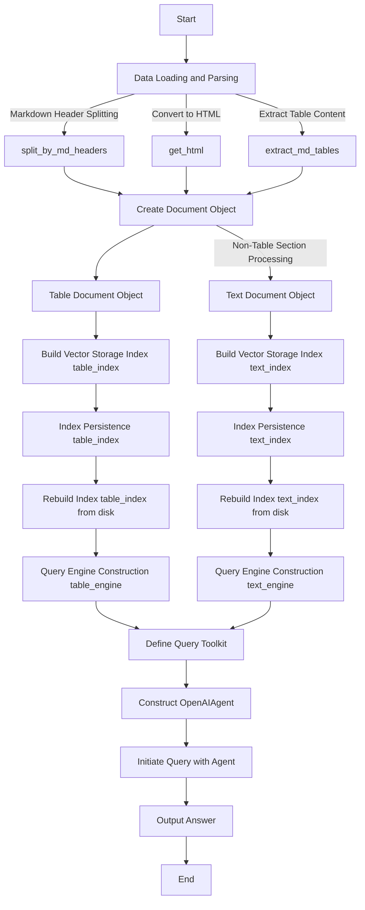
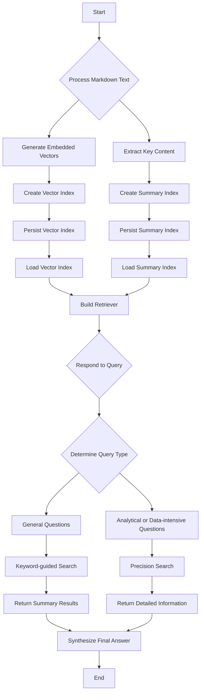
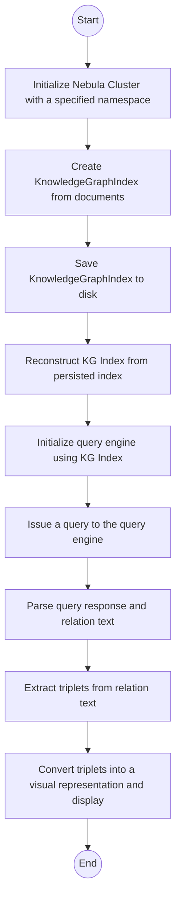

# Running Rag Retrievers on Docker Containers

## Technical Background

This demo utilizes technologies such as llama-index, OpenAI's models, and Knowledge Graph Indexing (KGI) to implement Retrieval-Augmented Generation (RAG), enhancing the efficiency and accuracy of private domain material retrieval queries.
This demonstration has explored three directions using three distinct query engines:

1. It deals with queries related to structured tabular data and unstructured plain text by isolating each type of content.
2. By identifying the user's search intent, it distinguishes between broad overviews and specific details to accurately fulfill information needs.
3. Utilizing a tree-like structure summary within the Graph Rag component, it responds to data-intensive queries in the form of rich graph-based representations.

### 1. Textual Features (Table+Text: Table-Tool & Text-Tool)

- **Markdown File Preprocessing**: Divide Markdown files into separate sections according to the headings and subheadings, recognize the plain text content and table content after converting to HTML format. Isolate the table data separately, and create vector-based query indexes for both text and table data. Persist the indices on the disk to enable subsequent queries to rebuild the indices without reprocessing the original data.
- **Retrieval**: Rebuild previously saved indices from disk using the llama-index framework, transforming table and text indices into corresponding `table_tool` and `text_tool` query engines.
- **Answer Synthesis**: The OpenAIAgent is configured to decide which tool to use based on the characteristics of the query. Conventional questions prefer `text_tool`; numerical and tabular queries lean towards `table_tool`; complex reasoning requires a combination of both tools. Additionally, the setting allows for a maximum number of function calls to be set to 3. The agent merges information retrieved by both table and text tools to form a comprehensive answer. This may include analyzing and interpreting structured data as well as understanding and elaborating on textual content.

<details>

We have not only improved the accuracy of table data retrieval for documents written in Markdown but also enhanced the capability of information extraction from the entire document, providing robust support for users when dealing with mixed documents containing both text paragraphs and tables.



</details>

### 2. Query Intent (Document Agent: Summary_Tool & Vector_Tool)

- **Markdown File Preprocessing**: Initially, Markdown files are divided into independent sections based on their titles and subtitles. Each section generates an embedding vector `VectorStoreIndex`, and additionally, a summary-style secondary index `SummaryIndex` is created for each part. These indices are persistently stored on the hard disk, allowing for rapid reconstruction of indexes for subsequent queries without reprocessing the original data.
- **Retrieval**: The detailed and summary indices are reconstructed from the hard disk through the llama-index framework. Index generation is based on keywords derived from parsing the content of the Markdown documents. Then, a document proxy is created for each keyword, and two different retrieval tools are set up to handle distinct types of retrieval tasks: a vector tool `vector_tool` for queries requiring detailed information, and a summary tool `summary_tool` suitable for answering questions that need a high-level overview. Under the guidance of index nodes containing directive instructions, a top-level composite retriever and search engine are created, forming a flexible and effective query processing architecture.
- **Response Synthesis**: Upon receiving a query request, OpenAIAgent is configured to choose the most appropriate tool based on the nature and complexity of the question. If the question is general or requires a summary, the `summary_tool` is prioritized; if the query involves specific details, the `vector_tool` is favored. In this way, the agent utilizes the retrieved detailed vector data or summary information to synthesize a comprehensive, context-relevant answer to accommodate the varying intents of users' queries.

<details>

By establishing a hierarchical structure of document proxies with embeddings and summaries, the system is capable of providing targeted answers for queries ranging from macro overviews to micro, data-intensive details. This approach allows the system to offer customized responses based on the user's familiarity with the knowledge base and the specific nature of the query, thereby covering a wide range of inquiries. General questions like "What is the setting of 'The Kingdom of Tears'?" and numerical queries such as "What is the speed of Link's horse Epona?" can be effectively addressed.



</details>

### 3. Graph Rag (KGI-Based)

- **Markdown File Preprocessing**

  - File Loading and Indexing: Markdown files are loaded into the system and indexed for quick retrieval in subsequent processes.

  - Knowledge Graph Index Construction: Data are indexed using the `KnowledgeGraphIndex.from_documents()` function, setting a maximum number of triples for each chunk.

  - Index Persistence: The generated index is persistently stored in the `../db_stores/kg_index` directory on disk, allowing the index to be rebuilt during queries without reprocessing the raw data.

- **Retrieval**

  - Query Engine Initialization: By invoking the `kg_index.as_query_engine()` method, the query engine is configured with a hybrid mode (exact and fuzzy) that includes text information, facilitating the generation of tree-like structured summary responses.

- **Response Synthesis**

  - Parsing Text Answers and Knowledge Relationships: Utilize `get_response_n_kg_rel_query(response)` to parse text answers and related entity relationships within the knowledge graph.
  - Triple Extraction: Extract triples in the form of `(Entity, Relationship, Entity)` from the knowledge graph relationship text.
  - Result Summary: The query engine summarizes information in a tree-like structure and generates hierarchical and structured answers based on the user's question.

<details>

Integrating knowledge graphs into queries provides numerous advantages such as highly structured data, enhanced semantic understanding, in-depth relational analysis, and precise information filtering, significantly enhancing the performance of information retrieval and question-answering systems. However, this approach also faces challenges including high construction costs, requirements for data timeliness, limited coverage, complex handling of entity ambiguities, and a high dependency on data quality. Further exploration will be conducted subsequently.



</details>

## Prerequisites

Before diving into this demo, please ensure that your system meets the following prerequisites:

1. **Operating System**: The demo is compatible with Linux operating systems and tested on Ubuntu 22.04.
2. **Docker**: It's required to have `docker` installed on your system.
3. **OpenAI API Key for ChatGPT**: If you wish to use the ChatGPT functionality within this demo, an OpenAI API key is required. Please note that usage of this API is subject to OpenAI's pricing and usage policies. We use OpenAI text generation models to optimize the parsing of some special components like titles or tables etc. Without this API key, you can still try all three approaches.

## Quick Start

1. Start by cloning this repository to your instance with Docker installed:

   ```shell
   git clone https://github.com/LinkTime-Corp/llm-in-containers.git
   cd llm-in-containers/rag-retrievers
   ```

2. Replace `<YOUR-OPENAI-API-KEY>` with your own API key in the .env file under the `/src/streamlit-web` directory.

3. Launch the demo:

   ```shell
   bash run.sh
   ```

    Visit the UI at http://{IP of Host instance}:8501. On the UI, you can choose any of the three query engines - "Table+Text", "Document Agent", or "Graph Rag (KGI-Based)" to explore the actual query results for the material "The Legend of Zelda: Tears of the Kingdom" (Fan-made).

4. Shut down the demo:

   ```shell
   bash shutdown.sh
   ```

## Using Your Own Markdown Files

1. Start by cloning this repository to your instance with Docker installed:

   ```shell
   git clone https://github.com/LinkTime-Corp/llm-in-containers.git
   cd llm-in-containers/rag-retrievers
   ```

2. Install dependencies in your local environment:

    ```shell
    pip install -r requirements.txt
    ```

3. Replace with your documents:
    Add your markdown format file under `/rag-retrievers/data`.
    Replace all occurrences of `/RAG-Zelda-Tears-of-the-Kingdom(Fan-made).md` with the new filename throughout in project.

4. Create a .env file in the `rag-retrievers` directory:

   ```shell
   echo "data_path=../data\nOPENAI_API_KEY=<YOUR-OPENAI-API-KEY>\nTOKENIZERS_PARALLELISM=False\nNEBULA_USER=root\nNEBULA_PASSWORD=nebula\nNEBULA_ADDRESS=<YOUR-IP-ADDRESS:9669>" > .env
   ```

   Replace `<YOUR-OPENAI-API-KEY>` with your own API key in the `.env` file under the `/rag-retrievers` directory.

5. Generate preprocessing `db_stores` required for Textual Features and Query Intent engines:

    Execute the code blocks in Jupyter Notebooks `exp_table.ipynb` and `exp_recursive.ipynb` under `/rag-retrievers/notebooks`, making sure to modify the system_prompt to match your file content beforehand, for regenerating parsed contents under `db_stores` and testing.

6. Generate preprocessing `db_stores` required for Graph Rag (KGI-Based) engine:

   - Install NebulaGraph locally. Refer to the installation instructions for Docker Desktop here. Once installed, click Studio in Browser to use NebulaGraph. Replace <YOUR-IP-ADDRESS:9669> with your own IP address in the `.env` file under the `/rag-retrievers` directory.
   - Execute the code blocks in Jupyter Notebook `exp_kg.ipynb` under `/rag-retrievers/notebooks`, and conduct testing with appropriate questions.

7. Create a .env file in the `/src/streamlit-web` directory:

   ```shell
   cd src/streamlit-web
   echo "OPENAI_API_KEY=<YOUR-OPENAI-API-KEY>\nTOKENIZERS_PARALLELISM=False" > .env
   ```

   Replace `<YOUR-OPENAI-API-KEY>` with your own API key in the `.env` file under the `/src/streamlit-web` directory.

8. Launch the demo:

   ```shell
   cd src/streamlit-web
   streamlit run demo.py
   ```

    Visit the UI at http://{IP of Host instance}:8501. On the UI, you can choose any of the three query engines - "Table+Text", "Document Agent", or "Graph Rag (KGI-Based)" to explore the actual query results for your own material.
